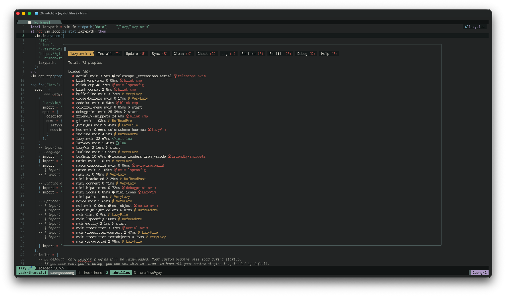
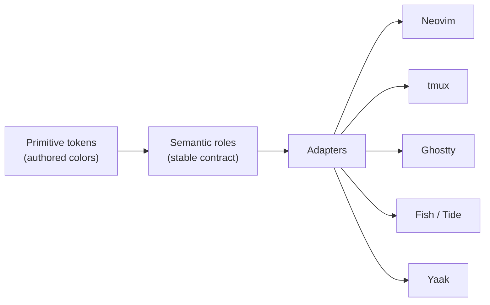

<div align="center">


# Hue Theme

**A portable theme design system rooted in the atmosphere and visual culture of Huế, Việt Nam.**

One versioned token contract → many hosts. Editor, terminal, and API-client themes
are all generated from the same source of truth.

<br/>



</div>

---

## Moods

| Mood          | Appearance | Feel                                        |
| ------------- | ---------- | ------------------------------------------- |
| **Huế Mưa**   | dark       | deep charcoal, rain silver, muted jade      |
| **Huế Hương** | dark       | river green, dusk blue, incense gold        |
| **Huế Cung**  | light      | ivory paper, imperial lacquer, royal purple |

Explore them in the interactive gallery: `bun run dev` (Vite + React, in `apps/gallery`).

## Themes

Every theme below is generated from the token contract, so the three moods stay
identical across hosts.

| Host                 | Package                                                | Get it                                                                        |
| -------------------- | ------------------------------------------------------ | ----------------------------------------------------------------------------- |
| **Neovim / LazyVim** | [`packages/nvim-plugin`](packages/nvim-plugin)         | [`crafts69guy/hue-nvim`](https://github.com/crafts69guy/hue-nvim) · lazy.nvim |
| **tmux**             | [`packages/tmux-plugin`](packages/tmux-plugin)         | [`crafts69guy/hue-tmux`](https://github.com/crafts69guy/hue-tmux) · TPM       |
| **Ghostty**          | [`packages/terminal-themes`](packages/terminal-themes) | theme file (`theme = hue-mua`)                                                |
| **Fish / Tide**      | [`packages/fish-themes`](packages/fish-themes)         | sourceable Fish theme files                                                   |
| **Yaak**             | [`packages/yaak-plugin`](packages/yaak-plugin)         | sideload / plugin registry                                                    |
| Inkdrop              | —                                                      | _planned_                                                                     |

## How it works

Three layers, each with a single responsibility:



1. **Primitive** — authored colors with cultural metadata, per mood, in DTCG format.
2. **Semantic** — stable roles (`surface.canvas`, `status.notice`, `syntax.keyword`, …)
   declared once in a versioned, validated contract.
3. **Adapters** — map semantic roles onto a host API without mutating source data.
   Each adapter declares which contract families it supports or explicitly omits.

The build validates every mood against the contract and WCAG AA contrast, then
writes the generated artifacts. See [`docs/architecture.md`](docs/architecture.md)
for the full picture and [`docs/cultural-direction.md`](docs/cultural-direction.md)
for the design rationale.

## Repository layout

```
packages/
  tokens/           # source tokens + build — the single source of truth
  nvim-plugin/      # generated Neovim colorscheme   → hue-nvim
  tmux-plugin/      # generated tmux TPM plugin       → hue-tmux
  terminal-themes/  # generated Ghostty theme files
  fish-themes/      # generated Fish/Tide theme files
  yaak-plugin/      # generated Yaak theme plugin
apps/
  gallery/          # interactive mood gallery (Vite + React)
```

## Development

```fish
bun install
bun run dev        # build tokens + run the gallery
```

Quality gates (Biome is the single formatter/linter for TS, React, JS, JSON, CSS, HTML):

```fish
bun run quality    # biome check + token/gallery check + tests
bun run ci         # the full non-mutating gate, incl. build
```

Source tokens follow the
[Design Tokens Community Group format](https://www.designtokens.org/tr/2025.10/format/).
**Generated artifacts must not be edited by hand** — change the tokens or adapters
and rebuild.

## Bundled font

The gallery bundles
[PlemolJP Console NF v3.0.0](https://github.com/yuru7/PlemolJP/releases/tag/v3.0.0)
in Light (300) through Bold (700), under the SIL Open Font License 1.1. Its full
license sits beside the fonts in `apps/gallery/public/fonts/PlemolJP-LICENSE.txt`.

## License

[MIT](LICENSE)
