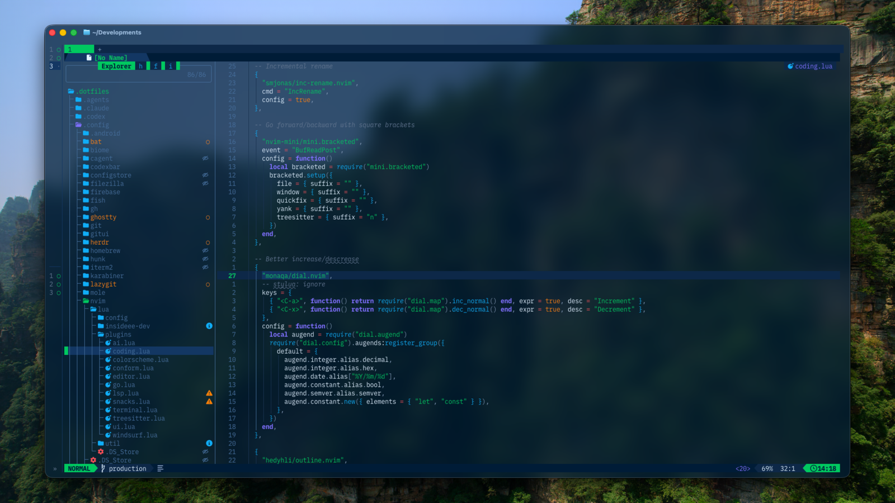
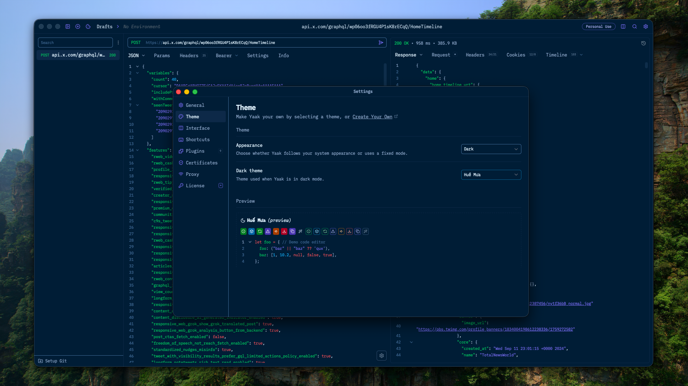
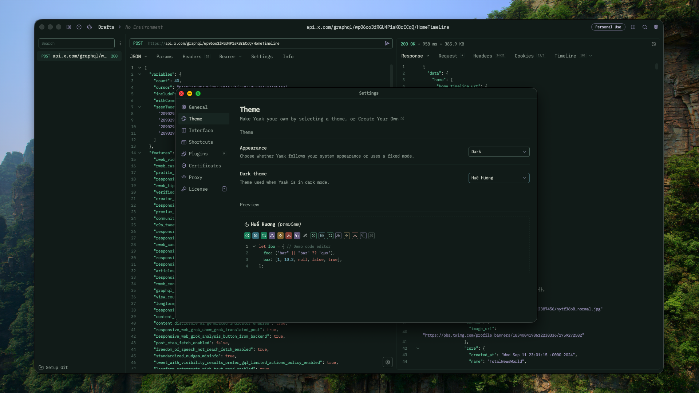
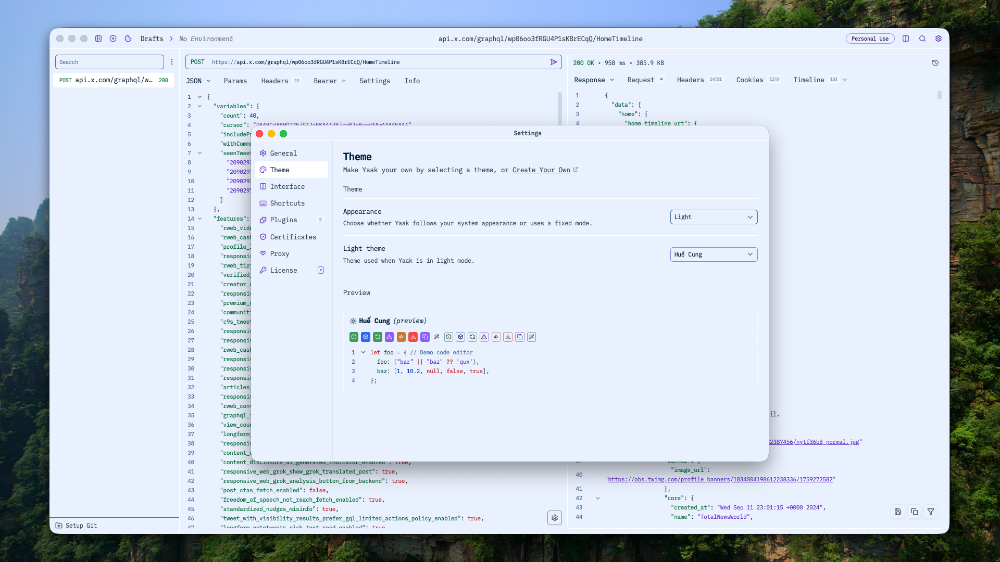
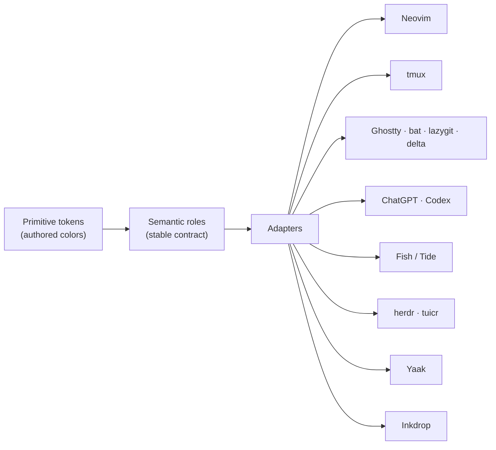

<div align="center">


# Hue Theme

**A portable theme design system rooted in the atmosphere and visual culture of Huế, Việt Nam.**

One versioned token contract → many hosts. Editor, terminal, and API-client themes
are all generated from the same source of truth.

<br/>



</div>

---

## Moods

| Mood          | Appearance | Feel                                            |
| ------------- | ---------- | ----------------------------------------------- |
| **Huế Mưa**   | dark       | midnight navy, rain-blue chrome, vivid signals  |
| **Huế Hương** | dark       | river green, dusk blue, incense gold            |
| **Huế Cung**  | light      | pale blue wash, white panels, deep blue accents |

## Themes

Every theme below is generated from the token contract, so the three moods stay
identical across hosts.

| Host                 | Package                                                | Get it                                                                        |
| -------------------- | ------------------------------------------------------ | ----------------------------------------------------------------------------- |
| **Neovim / LazyVim** | [`packages/nvim-plugin`](packages/nvim-plugin)         | [`crafts69guy/hue-nvim`](https://github.com/crafts69guy/hue-nvim) · lazy.nvim |
| **tmux**             | [`packages/tmux-plugin`](packages/tmux-plugin)         | [`crafts69guy/hue-tmux`](https://github.com/crafts69guy/hue-tmux) · TPM       |
| **Ghostty**          | [`packages/terminal-themes`](packages/terminal-themes) | theme file (`theme = hue-mua`)                                                |
| **ChatGPT / Codex**  | [`packages/codex-themes`](packages/codex-themes)       | Appearance import string (`hue-<mood>.txt`)                                   |
| **Fish / Tide**      | [`packages/fish-themes`](packages/fish-themes)         | sourceable Fish theme files                                                   |
| **Yaak**             | [`packages/yaak-plugin`](packages/yaak-plugin)         | sideload / plugin registry                                                    |
| **bat**              | [`packages/terminal-themes`](packages/terminal-themes) | `.tmTheme` files — `bat cache --build`                                        |
| **lazygit**          | [`packages/terminal-themes`](packages/terminal-themes) | `gui.theme` fragment merged via `LG_CONFIG_FILE`                              |
| **delta**            | [`packages/terminal-themes`](packages/terminal-themes) | git-config fragment — colors every diff, lazygit's Patch panel included       |
| **Inkdrop**          | `packages/hue-*-theme`                                 | 3 unified Inkdrop v6 packages, on the registry                                |
| **herdr + tuicr**    | [`packages/herdr-plugin`](packages/herdr-plugin)       | `herdr plugin install` — themes herdr and the tuicr review TUI                |

### [Yaak](packages/yaak-plugin)

The complete Huế palette for requests, responses, settings, and application chrome.

| Huế Mưa | Huế Hương | Huế Cung |
| --- | --- | --- |
|  |  |  |

## How it works

Three layers, each with a single responsibility:


```mermaid
flowchart LR
    P["Primitive tokens<br/>(authored colors)"] --> S["Semantic roles<br/>(stable contract)"]
    S --> A["Adapters"]
    A --> N["Neovim"]
    A --> T["tmux"]
    A --> G["Ghostty · bat · lazygit · delta"]
    A --> C["ChatGPT · Codex"]
    A --> F["Fish / Tide"]
    A --> H["herdr · tuicr"]
    A --> Y["Yaak"]
    A --> I["Inkdrop"]
```

1. **Primitive** — authored colors with cultural metadata, per mood, in DTCG format.
2. **Semantic** — stable roles (`surface.canvas`, `status.notice`, `syntax.keyword`, …)
   declared once in a versioned, validated contract.
3. **Adapters** — map semantic roles onto a host API without mutating source data.
   Each adapter declares which contract families it supports or explicitly omits.

The build validates every mood against the contract and WCAG AA contrast, then
writes the generated artifacts. See [`docs/architecture.md`](docs/architecture.md)
for the full picture and [`docs/cultural-direction.md`](docs/cultural-direction.md)
for the design rationale.

## Repository layout

```
packages/
  tokens/           # source tokens + build — the single source of truth
  nvim-plugin/      # generated Neovim colorscheme   → hue-nvim
  tmux-plugin/      # generated tmux TPM plugin       → hue-tmux
  terminal-themes/  # generated Ghostty theme files
  codex-themes/     # generated ChatGPT/Codex import strings
  fish-themes/      # generated Fish/Tide theme files
  yaak-plugin/      # generated Yaak theme plugin
  herdr-plugin/     # generated herdr + tuicr theme fragments
  hue-*-theme/      # generated unified Inkdrop v6 packages
```

## Development

```fish
bun install
bun run build      # resolve tokens, validate, write every adapter's output
```

Quality gates (Biome is the single formatter/linter for TS, JS, JSON, CSS):

```fish
bun run format     # apply Biome formatting/import-order fixes before CI
bun run format:check
bun run quality    # biome check + token check + tests
bun run ci         # the full non-mutating gate, incl. build
```

`bun run ci` starts with `biome ci .`, so formatting or import-order drift fails
before typechecks, tests, or builds run. After changing token adapters, run
`bun run build` first so generated artifacts are refreshed, then `bun run format`
and `bun run ci`.

Releasing touches four channels, only two of which `scripts/release-all.sh`
covers — see [`docs/distribution.md`](docs/distribution.md) for which host is
reached by what, and why a green build is not evidence that anything shipped.

```fish
scripts/release-all.sh --tag vX.Y.Z   # subtree repos + tag this one
bun run publish:inkdrop               # ipm registry
bun run publish:yaak                  # Yaak plugin registry
```

Inkdrop packages target the v6 unified theme model: one package per mood covers
the app UI, editor syntax, rendered Markdown preview, Mermaid diagrams, GitHub
alerts, and scrollbars, and thins its surfaces out when the acrylic window is on.

Source tokens follow the
[Design Tokens Community Group format](https://www.designtokens.org/tr/2025.10/format/).
**Generated artifacts must not be edited by hand** — change the tokens or adapters
and rebuild.

## License

[MIT](LICENSE)
